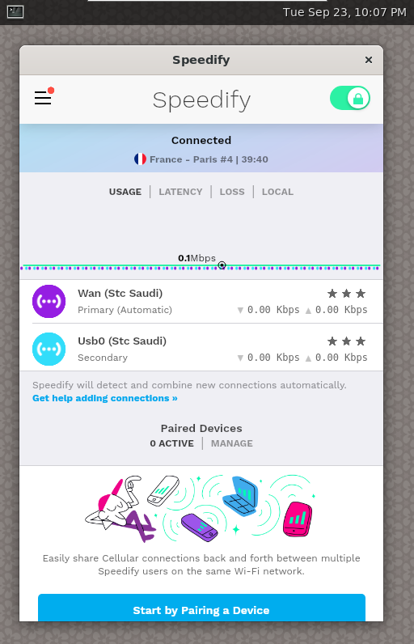

# Custom Speedify on BananaPi R4 running Debian 13

## Current configuration and additions
- LAN gateway: `192.168.1.1` (/24)
- DNS: `1.1.1.1` *

***Important to prevent PBR leaks, local resolver requires hotplug**

### Ports
| Hardware Names | USB | SFP-1 | SFP-2 | WAN | E1  | E2  | E3  |
|----------------|-----|-------|-------|-----|-----|-----|-----|
| `networkd` names | usb0 | -     | -     | wan1 | wan2 | lanbr0 | lanbr0 |
| Roles          | WAN  | -     | -     | WAN  | WAN  | LAN  | LAN  |
| PBR Range 192.168.1.X      | -    | -     | -     |  16 - 31  | 32 - 47 | - | - | - |

### Features
- Policy based routing pre-configured, reserved by DHCP:

    Set a static IP on the client as indicated by the *Ports* table to choose which WAN to use.
- LED indicator assignments:
    - Blue LED: CPU load - Heartbeat (blue is preffered to be used the least due to low service life, e.g distant blinks)
    - Green LED: Speedify VPN tunnel status and TX/RX activity
- BBR and FQ QDISC enabled for better uploads to distant servers as extensively tested
- Disabled IPv6 in kernel network stack needed for PBR and leaks
- Non-blocking NTP time sync
- Latest kernel with ethernet switch fixes using vanilla Debian from https://github.com/frank-w/BPI-Router-Linux
- Mobile friendly Speedify UI control over VNC to comply with Speedify Raspberry Pi sharing setup

     


## Network recovery
In case of misconfiguration, accessing the router could be difficult, you can modify and customize out of band using a flash drive.

- Format a flash drive with FAT32 under label `ROUTER` (all capital)
- Copy content of `network` folder in this repository to the flash drive
- Make sure that any modification made to the file is done with LF (Line Feed) as the default newline character e.g VScode.
- Plug in the drive to the router and power on
- You may need to remove the drive and power cycle the router for modified `.link` files.

## Installation
- Download latest Debian Trixie image from https://drive.google.com/drive/folders/1A5S7_82Bg4EYxjzdQ5FKyBw9Qi2C3uK- or build https://github.com/frank-w/BPI-Router-Images (custom kernel, limited boot partition size for initramfs #FIXME)
- Use BalenaEtcher or any other imaging software with an SD card (8GB+)
- Both latches should be down for SD card boot
- Plug in ethernet to E3 (far right)
- SSH to 192.168.1.1 
    - Username: `root` 
    - Password: `bananapi`
- Connect a stable internet connection to WAN (far left)
- Run the following commands to clone this repository and automatically configure
```
#Frank-w build specific
systemctl disable hostapd
systemctl stop hostapd
/bin/rm -v /etc/ssh/ssh_host_*
dpkg-reconfigure openssh-server
systemctl restart ssh

#Speedify and dependencies
apt update
apt install ntpsec-ntpdate

ntpdate pool.ntp.org

apt update
apt install sudo git wget curl rsync systemd-timesyncd ethtool weston iptables htop 

bash -c "$(curl -sL https://get.speedify.com)" 
apt install speedifyui

#Imporant: Login from GUI doesn't work
speedify_cli login username
speedify_cli startupconnect on

# Default service disabled since it's unreliable with networkd and timesyncd, especially with all WANs down
systemctl disable speedify
systemctl stop speedify


git clone https://github.com/TalalMash/Custom-Speedify-Debian13-BPIR4
cd Custom-Speedify-Debian13-BPIR4

bash install.sh
```
- Use RealVNC on phone/tablet/laptop with the default port on 192.168.1.1 to view Speedify UI, credentials match SSH login
- Note that everytime a new VNC connection is made, the GUI is restarted due to a bug with Wayland relative mouse with GTK apps 

    This doesn't affect networking, there is however an annoying 10 second delay before Speedify UI appears #FIXME
- You need to select a server at least once from the UI or command for auto connect on start/boot.

**You can modify the content of network, install script and setup folder on existing installation to update it.**

## Banana Pi R4 Known Issues
- Mixing 100Mbit and 1Gbit devices on bridged LAN ports (2-3) cuts the gigabit port to half speed. 

    Track issue here: https://forum.banana-pi.org/t/bpi-r4-bad-switch-performance-in-upload/17407

## Experimental options
####  Disable common ethernet/TCP offload
Useful for some ethernet USB devices and mobile hotspots.

Degrades multi-gig performance (untested).

`/etc/udev/rules.d/99-disable-offload.rules` 
```
ACTION=="add", SUBSYSTEM=="net", KERNEL!="lo", RUN+="/usr/sbin/ethtool -K %k autoneg off gro off gso off tso off rx off tx off"
```
